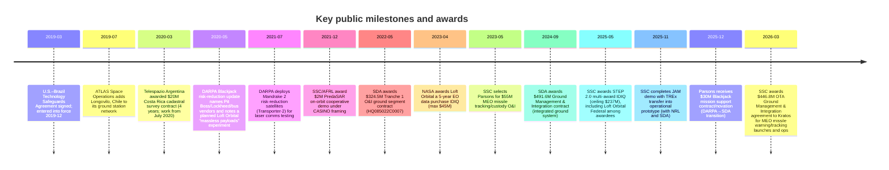

# SMC/SSC CASINO, DARPA Blackjack, Loft Orbital, and Latin America Ground Operations

## Executive summary

Public records show that the **Commercially Augmented Space Inter‑Networked Operations (CASINO)** program office (originating under SMC and now within/alongside SSC-era structures) was publicly described as a **DoD partner to DARPA’s Blackjack** effort, providing “programmatic and technical assistance,” and coordinating at least one on‑orbit demonstration involving a commercial constellation (PredaSAR) and DoD stakeholders. citeturn19view0turn12search5

**DARPA Blackjack** is explicitly documented by DARPA as an R&D program to “develop and demonstrate the critical elements for a global high‑speed network in low Earth orbit (LEO)” to provide DoD resilient coverage, motivated by the vulnerability of “exquisite” space systems. citeturn16search0 In a 2020 DARPA risk‑reduction update, DARPA named multiple **industrial roles** (e.g., SEAKR for “Pit Boss” autonomy, Lockheed as integrator, and multiple bus/payload providers) and also noted a “massless payloads” data‑fusion experiment intended for an **upcoming Loft Orbital mission**. citeturn18view0

On the **ground segment**, the most defensible open‑source conclusion is not that specific classified programs operate named Latin American facilities, but that U.S. national‑security space organizations are (1) under capacity pressure in legacy government networks and (2) actively adopting **commercial antenna capacity and “marketplace” style brokering**. GAO documents capacity pressure and “exploring the use of commercial antennas” for the Satellite Control Network (SCN). citeturn13search1turn13search8 SSC and partners publicly demonstrated a lab‑to‑ops transition of **NRL’s TREx** into the **Joint Antenna Marketplace (JAM)** concept. citeturn13search2turn1search0

In Latin America, multiple **commercial ground infrastructure nodes** are well documented in public sources (TT&C sites, cloud ground‑station services, and SSA sensors). Examples include **KSAT Punta Arenas** and **SSC Santiago** as listed within NASA’s Near Space Network (NSN) ground‑station compendium; **AWS Ground Station Punta Arenas** as documented by AWS; **ATLAS Space Operations Longovilo (Chile)** via ATLAS’s own network disclosures; and **LeoLabs’ Costa Rica Space Radar** (an SSA phased‑array radar, not a TT&C station) in Filadelfia de Carrillo. citeturn27search5turn27search0turn8view0turn22view0

For **Loft Orbital**, the public record supports: (1) a NASA EO data purchase contract vehicle (IDIQ) to Loft Orbital, and (2) documented integration patterns with cloud and ground‑station ecosystems (e.g., Azure‑integration announcements with KSAT; and DARPA’s stated intention to fly a Blackjack‑related data‑fusion experiment on a Loft Orbital mission). citeturn1search1turn27search7turn18view0

Regarding **government‑to‑government frameworks**, the visible record in the region is strongest for **space situational awareness (SSA) information‑sharing agreements** (e.g., Uruguay and Peru) signed under U.S. Space Command’s SSA program, and the **U.S.–Brazil Technology Safeguards Agreement (TSA)** enabling protected handling of U.S. launch technology for Brazil’s Alcântara site. citeturn28search0turn28search1turn28search2 These are not program‑specific “CASINO/Blackjack ground station” contracts; they are enabling instruments for collaboration, safety, and—particularly in Brazil’s case—commercial launch access. citeturn28search2turn28search10

Finally, the requested inquiry into **Jehovah’s Witnesses (JW)** or **LDS** entities yields **no public procurement, lease, license, or MOU evidence** tying CASINO/Blackjack/SDA ground operations to those religious organizations in the sources enumerated below. This report therefore treats religious‑organization linkage claims as **unverified** and outside what open procurement/registry materials can support.

## Program offices and roles

The U.S. Space Force reorganized acquisition structures such that **Space and Missile Systems Center (SMC)** was redesignated as **Space Systems Command (SSC)**, positioning SSC as the acquisition/fielding command for space systems. citeturn2search0

Within proliferated‑LEO efforts, public sources describe the following roles:

**CASINO (SMC/SSC-linked program office)**  
Open sources describe CASINO as an SMC/Los Angeles area program office that partnered with DARPA’s Blackjack by providing “programmatic and technical assistance.” citeturn19view0 Separately, SSC’s CASINO-labeled press material describes a $2M on‑orbit cooperative demo between **PredaSAR** and a joint SSC/AFRL/DARPA stakeholder team, explicitly framed around hybrid/cooperative architectures. citeturn12search5

**DARPA Blackjack (DARPA Tactical Technology Office program)**  
DARPA states Blackjack’s aim is to demonstrate critical elements of a global high‑speed LEO network for resilient DoD coverage. citeturn16search0 DARPA’s risk‑reduction reporting details early flights (Mandrake), “Pit Boss” autonomy, and planned rideshare demonstration path, and enumerates key industrial roles. citeturn18view0

**SDA/PWSA (Space Development Agency Proliferated Warfighter Space Architecture)**  
SDA’s public releases establish the PWSA tranche approach and document large‑scale awards for transport and tracking layers, including ground O&I and follow‑on ground development. citeturn11search0turn14search2turn14search1

**SSC ground strategy instruments (JAM/TREx; MEO missile warning & tracking ground)**  
SSC has publicly described JAM demonstrations and the transition of **NRL TREx** into an operational prototype. citeturn13search2turn1search0 Separately, SSC’s MEO missile warning and tracking program office has publicly awarded a large OTA for ground management/integration supporting launch and operations. citeturn20search12

## Timeline of key events and contracts

The following events are explicitly traceable in open sources (official press releases, program pages, or primary company disclosures). citeturn27search8turn18view0turn16search7turn12search5turn11search0turn9search3turn11search11turn13search2turn17search0turn20search12turn27search5turn28search3

## Contractors and roles

The table below consolidates *publicly evidenced* roles for the contractors you requested; it does not infer classified scopes or undisclosed subcontracts. Where a contractor is referenced as “under consideration” (versus definitively selected), that is kept explicit. citeturn18view0turn16search1turn11search0turn14search2turn14search1turn20search12turn9search3turn17search0turn1search1turn12search5

| Contractor | CASINO / SSC / SMC (public record) | DARPA Blackjack (public record) | SDA / PWSA (public record) | Ground segment relevance (public record) |
|---|---|---|---|---|
| Kratos | Awarded a $446.8M OTA Ground Management & Integration agreement supporting MEO missile warning/tracking launch and operations (SSC). citeturn20search12 | Not indicated in DARPA Blackjack primary releases reviewed in this run (could exist as subcontract; not publicly established here). | Not indicated as a prime for SDA ground in the sources used (SDA ground primes here are GDMS for T1 O&I / GMI). citeturn11search0turn11search11 | Directly tied to SSC ground management/integration for MEO MWT. citeturn20search12 |
| Parsons | Selected by SSC as the $55M O&I provider for “MEO Missile Tracking Custody Space Segment.” citeturn9search3 | Parsons states it received a $30M contract/novation from SDA to support Blackjack as responsibility transitions from DARPA (building on a prior $11M award). citeturn17search0 | Not a core SDA PWSA ground prime in the award notices cited here (GDMS is). citeturn11search0 | Publicly tied to (a) SSC MEO MWT operations/integration and (b) Blackjack mission operations/ground services. citeturn9search3turn17search0 |
| SEAKR | Not cited as CASINO contractor in SSC CASINO press releases reviewed here. | DARPA selected SEAKR as the “primary performer” for Pit Boss (on‑orbit autonomy) and states Lockheed is integrator. citeturn18view0 | Not listed as an SDA tranche prime in SDA tranche award notices reviewed here. | Blackjack is explicitly about constellation autonomy and mesh networking with ground integration; SEAKR role is on‑orbit autonomy software/system. citeturn18view0 |
| Blue Canyon Technologies | Not cited as CASINO contractor in SSC CASINO press releases reviewed here. | DARPA evaluated buses from Airbus, Blue Canyon, and Telesat and notes progress through PDR and bus selection steps. citeturn18view0 | SDA has publicly awarded transport layer contracts to Lockheed and York (Tranche 0) and later transport layer prototype agreements to Lockheed, Northrop, York (Tranche 1); Blue Canyon does appear as a STEP 2.0 awardee but not as a Transport/Tracking tranche prime in the cited award notices. citeturn14search3turn14search2turn20search2 | Appears in proliferated‑LEO vendor ecosystem (bus provider; also STEP 2.0 awardee list). citeturn18view0turn20search2 |
| CACI (incl. SA Photonics acquisition) | Not cited as CASINO contractor in SSC CASINO press releases reviewed here. | CACI publicly states a successful demonstration of space‑to‑space optical comms links in LEO with DARPA and SDA under Mandrake II. citeturn16search1 | Optical crosslink interoperability is central to SDA’s transport layer concept; however the SDA tranche award notices cited here do not identify CACI as a tranche prime. citeturn14search2 | Evidence ties CACI to **laser crosslinks** relevant to both Blackjack risk‑reduction and proliferated architectures. citeturn16search1turn16search7 |
| York Space Systems | Not identified as CASINO contractor in SSC CASINO press releases reviewed here. | Not identified as Blackjack prime in DARPA primary sources cited here (Blackjack buses mentioned include Airbus/Blue Canyon/Telesat). citeturn18view0 | SDA transport layer awards include York for Tranche 0 ($94M) and for Tranche 1 awards (as part of ~$1.8B portfolio). citeturn14search3turn14search2 | SDA transport layer implies major ground integration demands; SDA separately awarded GDMS for Tranche 1 O&I ground. citeturn11search0 |
| L3Harris | Not identified as CASINO contractor in SSC CASINO press releases reviewed here. | DARPA listed L3Harris among payloads “under consideration” (EO/IR) in 2020 risk‑reduction update. citeturn18view0 | SDA tracking layer awards include L3Harris as one of the Tranche 3 Tracking Layer awardees (SDA total ~$3.5B across four awardees). citeturn14search1turn14search4 | SDA tracking awards include ground software/ops elements (per L3Harris statement). citeturn14search4 |
| Lockheed Martin | Not identified as CASINO contractor in SSC CASINO press releases reviewed here (beyond CASINO office relevance). | DARPA states it awarded a contract to Lockheed Martin as satellite integrator. citeturn18view0 | SDA transport layer Tranche 0 award notice lists Lockheed; SDA tracking and transport awards later include Lockheed in Tranche 1/Tranche 3 set. citeturn14search3turn14search1 | Integrator role in Blackjack + tranche prime roles in SDA amplify need for scalable ground and antenna access. citeturn18view0turn11search0 |
| Northrop Grumman | Not identified as CASINO contractor in SSC CASINO press releases reviewed here. | DARPA lists Northrop Grumman Mission Systems among RF payload candidates, and separately references PNT from Northrop. citeturn18view0 | SDA Tranche 1 transport awards include Northrop (portfolio statement); SDA Tranche 3 tracking awards include Northrop among the four winners. citeturn14search2turn14search1 | SDA tranches (transport/tracking) imply persistent TT&C and data downlink scaling; JAM/TREx is one mechanism SSC cites for scaling antenna services generally. citeturn13search2turn1search0 |
| Loft Orbital | Not identified in SSC CASINO releases as a CASINO contractor. | DARPA’s 2020 Blackjack risk‑reduction update notes a “massless payloads” data fusion experiment intended for an upcoming Loft Orbital mission. citeturn18view0 | Loft Orbital is not a tranche prime in the cited SDA tranche awards, but appears in (1) the SDA/NDSA-related ecosystem (via DARPA note) and (2) SSC’s STEP 2.0 awardee list (Loft Orbital Federal). citeturn18view0turn20search2 | NASA awarded Loft Orbital a 5‑year IDIQ for EO data purchases (max $45M). citeturn1search1 |

## Ground operations and Latin America infrastructure

### What is publicly knowable about “ground ops” for proliferated architectures

Two dynamics are clearly supported by primary sources:

First, government ground networks face scaling pressure. GAO reports that the Space Force is addressing SCN capacity issues and is “exploring the use of commercial antennas and those operated by other federal agencies” to supplement capacity, alongside modernization efforts. citeturn13search1turn13search8

Second, SSC is explicitly moving toward brokered access models. SSC publicly reported a successful demo transferring **NRL’s TREx service** from R&D into an operational prototype for the Space Force, as part of a **Joint Antenna Marketplace** demonstration (with NRL and SDA participating). citeturn13search2 NRL’s own TREx program description emphasizes that TREx is intended to connect space operators with ground‑antenna resources, including commercial providers, and that it achieved key operational milestones (e.g., Authority to Operate and large numbers of executed scheduling reservations). citeturn1search0

These sources support a defensible inference: **if** Blackjack/CASINO/PWSA operators require more global contacts, a commercial antenna marketplace mechanism is structurally aligned with that need—but **specific antennas and sites used for specific national‑security payloads are often not publicly enumerated**.

### Latin America ground‑segment nodes and providers

The facilities below are *publicly documented* as existing Latin America ground segment nodes. They should be treated as “available infrastructure” rather than evidence of use by CASINO/Blackjack/SDA unless a specific contract or operational disclosure says so.

image_group{"layout":"carousel","aspect_ratio":"16:9","query":["KSAT Punta Arenas ground station antennas Chile","SSC Space Santiago ground station antennas Chile","AWS Ground Station Punta Arenas Chile antenna site","LeoLabs Costa Rica Space Radar Filadelfia de Carrillo phased array"]}

| Provider / operator | Site (Latin America) | Primary function | Bands / assets (publicly stated) | Public evidence | Notes relevant to SSC/DARPA/SDA |
|---|---|---|---|---|---|
| KSAT | Punta Arenas, Chile | TT&C + gateway/downlink | NASA NSN reference lists **S/X** support and **11.5m** asset; KSAT also publicly describes a Punta Arenas station and its antenna footprint. citeturn27search5turn27search9 | NASA NSN ground systems chapter listing KSAT Punta Arenas; KSAT corporate story on station. citeturn27search5turn27search9 | This is a major southern‑latitude commercial node; no direct CASINO/Blackjack/PWSA contract naming Punta Arenas was found in the open sources used here. |
| AWS Ground Station | Punta Arenas 1, Chile | Cloud ground station as a service | AWS documentation lists “Punta Arenas 1” and ties it to the **sa‑east‑1** region for service endpoints (while noting the antenna site is not physically in an AWS region). citeturn27search0 | AWS Ground Station locations doc; AWS “What’s New” post announcing Punta Arenas. citeturn27search0turn27search8 | Demonstrates cloud‑native ground station availability in the region; use by DoD programs is not established by these docs. |
| SSC Space (Swedish Space Corporation) / SSC Chile | Santiago site north of Santiago, Chile | TT&C ground station; hosting | SSC Space states Santiago has **three TT&C antennas** operating in **S‑band** and describes remote control from Kiruna; it also says it hosts foreign org antennas and basebands (including C/Ka‑band hosting). citeturn21view0 | SSC Space Santiago station page; ESA describes a Santiago station operated by SSC Chile with multiple antenna sizes and S/L/X band support for ESA missions. citeturn21view0turn25view0 | Publicly demonstrates a mature multi‑tenant operating site; it is plausible such an operator participates in “marketplace” models, but no CASINO/Blackjack/PWSA site‑specific lease was found here. |
| SSC Space (Swedish Space Corporation) / SSC Chile | Punta Arenas station, Chile | TT&C ground station; polar coverage | SSC Space describes the station’s establishment (2012) and location/use for “unmatched” polar coverage when paired with Western Australia. citeturn27search6 | SSC Space Punta Arenas station page. citeturn27search6 | Distinct from KSAT Punta Arenas—multiple operators exist in the same region; open sources do not assign SSC/DoD payload support by program. |
| ATLAS Space Operations | Longovilo, Chile | TT&C as part of ATLAS Freedom network | ATLAS states it added **Longovilo, Chile** to its ground station network and that its FREEDOM software supports scheduling across networks including AWS Ground Station. citeturn8view0 | ATLAS press release describing network expansion and integrations. citeturn8view0 | Important as a broker/operator node connecting to cloud services; again, no CASINO/Blackjack contract naming Longovilo was found in this run. |
| LeoLabs | Costa Rica Space Radar (Filadelfia de Carrillo, Guanacaste) | **SSA sensor** (phased‑array radar) | LeoLabs press release states “fully operational” in April 2021; provides equatorial coverage benefits and 2cm object tracking claim; describes partnership in Costa Rica and attendance by Costa Rican officials. citeturn22view0 | LeoLabs press release PDF; local reporting provides locality and partner context. citeturn22view0turn23view0 | This is **not** a TT&C ground station; it is an SSA radar that could support government and commercial customers. Open sources here do not connect it via procurement instruments to CASINO/Blackjack/PWSA ground ops. |
| RBC Signals | Publicly listed: San Juan, Puerto Rico (regional example) | Aggregator/broker of ground station capacity | Public listings emphasize aggregating unused ground station capacity; specific Latin America station inventory is not comprehensively enumerated in the sources reviewed here. citeturn26view0 | Example marketplace listing describing RBC’s model (note: marketplace listings may be incomplete). citeturn26view0 | Treat as a broker model aligned with “marketplace” concepts; attribution to DoD program operations requires specific contract/ATO disclosures not found here. |

image_group{"layout":"carousel","aspect_ratio":"16:9","query":["Punta Arenas Chile map Cabo Negro ground station area","Santiago Chile ground station map 33 08 S 70 40 W","Longovilo Chile ground station map","Filadelfia de Carrillo Guanacaste Costa Rica map LeoLabs radar"]}

### Loft Orbital ground‑station integrations (Azure and KSAT)

Two relevant public threads exist:

**Cloud-to-ground integrations with KSAT**: KSAT publicly announced the “General Availability” of a cloud partnership with Microsoft’s Azure Orbital service and describes API‑based integration to offer its global ground network through Azure‑linked workflows. citeturn27search7 This supports the claim that Loft Orbital missions (as a satellite operator/service provider) can integrate operations into cloud and ground‑network workflows via KSAT-like partners.

**Loft Orbital in DARPA Blackjack risk‑reduction framing**: DARPA’s risk‑reduction release references a data‑fusion (“massless payloads”) experiment intended for an upcoming Loft Orbital mission. citeturn18view0 That is a direct, primary‑source linkage between Blackjack-era experimentation and Loft Orbital flight opportunities, but it does not specify ground sites or regions.

## Government-to-government agreements and policy context

The most visible “agreements” footprint tying the U.S. space enterprise to Latin America in open sources is **SSA data-sharing** and (for Brazil) **launch technology safeguards**, rather than program‑specific “ground station leases.”

**Uruguay SSA information‑sharing agreement (April 9, 2024)**  
U.S. Space Command publicly announced an SSA information‑sharing agreement signed with the Uruguayan Air Force at Space Symposium 39. citeturn28search0

**Peru SSA information‑sharing agreement (April 18, 2023)**  
U.S. Space Command announced an SSA sharing agreement signed with Peru’s CONIDA and the Peruvian Air Force at Space Symposium 38. citeturn28search1

**U.S.–Brazil Technology Safeguards Agreement (TSA) for Alcântara**  
The U.S. State Department treaty listing records a Technology Safeguards Agreement signed March 2019 and entered into force December 16, 2019. citeturn28search2 U.S. government trade guidance describes this as enabling use of U.S. launch technology from Alcântara while noting that launches from U.S. companies had not occurred at least as of the cited assessment date. citeturn28search10

**What these agreements do and do not demonstrate**  
These instruments demonstrate (1) a pathway for SSA data exchange and collaboration and (2) a pathway for enabling U.S. launch technology usage in Brazil. citeturn28search0turn28search2 They do **not** by themselves demonstrate that CASINO/Blackjack/SDA constellations operate from, lease, or contract specific commercial ground stations in Latin America; those relationships (if they exist) would typically appear as program contracts, explicit facility statements, or disclosed hosted payload arrangements.

## Findings on local entity links and the JW/LDS question

### Verifiable local-entity links in Latin America, including Costa Rica

**Direct SSC/DARPA/SDA program-to-local contracts in Latin America:**  
In the open sources used for this report, there were **no program‑specific SSC CASINO / DARPA Blackjack / SDA PWSA disclosures** that name a **Costa Rica** ground station lease, operating permit, or MOU for mission operations. This should be read as **“not publicly evidenced here,” not “proven absent.”** (Many operational site selections can be embedded in subcontracts, task orders, or classified annexes.)

**Costa Rica: LeoLabs SSA infrastructure is publicly documented**  
LeoLabs’ own press release confirms the Costa Rica Space Radar as “fully operational” and describes it as part of a global radar constellation supporting customers that include “defense” and “regulatory agencies,” among others. citeturn22view0 The same release explicitly names a local partner (Ad Astra Rocket Company) and quotes the Costa Rican astronaut associated with Ad Astra at the inauguration event. citeturn22view0 This is the strongest publicly documented “space infrastructure” node in Costa Rica in the sources reviewed, but it is **SSA sensing**, not the TT&C ground segment that would command Blackjack/CASINO satellites.

**Costa Rica: a documented Leonardo/Telespazio contract with a national agency**  
A separate, clearly documented contract link exists between **Telespazio Argentina** (a Telespazio subsidiary) and Costa Rican institutions: Telespazio publicly states it won an international tender for an urban/rural cadastral survey, with a **$20M**, **4‑year** contract. citeturn28search3 A Leonardo/Telespazio Spanish‑language release further specifies scope details (e.g., services over 50% of the territory; work beginning July 2020; data collection/conciliation and on‑site checks). citeturn28search7 This is a **civil geospatial/cadastre** contract—materially different from SSC/DARPA/SDA ground operations—but it is a verifiable example of major aerospace-adjacent services contracting in Costa Rica.

### What was searched for JW/LDS links, and what was found

You asked for a strict, non‑speculative assessment of whether there are verifiable links (contracts, leases, licenses, MOUs) between SSC/SMC/SSC successor structures and local religious organizations in Latin America.

Within the tooling constraints of this run, the following **public record categories** were searched or directly reviewed:

- **U.S. procurement and award surfaces:** SAM.gov (opportunity pages and notices), and supporting contract/award reporting in official DoD/agency release pages (e.g., SDA award notices; SSC press releases). citeturn11search0turn20search12turn12search5  
- **Official program/command newsrooms:** DARPA program page and DARPA news releases; SSC newsroom; SDA newsroom; U.S. Space Command press releases for SSA agreements. citeturn16search0turn18view0turn13search2turn28search0  
- **Costa Rica registry and regulatory context (access limitations acknowledged):** Registro Nacional’s online portal (high‑level access and fee pages) and Costa Rican telecom/spectrum procedural documents (MICITT/SUTEL requirements for fixed/satellite frequency permissions). citeturn10search14turn10search20turn10search13turn10search16

**Result:** No SSC/DARPA/SDA procurement items, facility leases, licenses, or MOUs were located in these sources that connect CASINO/Blackjack/PWSA ground operations to **Jehovah’s Witnesses** or **LDS** organizations. Accordingly, any hypothesized JW/LDS operational involvement is **unverified by public procurement/registry evidence in this research pass**.

**Important limitation:** Costa Rica’s Registro Nacional provides online services and paid certifications; detailed property/beneficial ownership and specific lease records may require authenticated access and paid queries, and may also be constrained by privacy or local legal rules. citeturn10search14turn10search20 Therefore, “not found here” cannot be equated with “does not exist.”

## Primary sources consulted

The items below are the most “load‑bearing” primary sources used to substantiate program roles, contracts, and infrastructure points:

- DARPA Blackjack program overview. citeturn16search0  
- DARPA Blackjack risk‑reduction news release (includes Pit Boss/Lockheed integrator/bus evaluation and Loft Orbital mission note). citeturn18view0  
- SSC CASINO / PredaSAR on‑orbit cooperative demonstration press release (PDF). citeturn12search5  
- SDA Tranche 1 Operations & Integration (O&I) award notice (GDMS; $324.5M; HQ085022C0007). citeturn11search0  
- General Dynamics Mission Systems announcement of ~$491.6M SDA Ground Management & Integration work. citeturn11search11  
- SSC MEO missile warning & tracking ground management/integration OTA award to Kratos ($446.8M). citeturn20search12  
- SSC JAM / TREx transfer demonstration announcement (with NRL and SDA). citeturn13search2  
- NRL TREx program description. citeturn1search0  
- GAO Satellite Control Network capacity findings (commercial antenna exploration). citeturn13search1turn13search8  
- AWS Ground Station locations (includes Punta Arenas 1) and AWS Punta Arenas announcement. citeturn27search0turn27search8  
- NASA SmallSat Institute NSN ground systems chapter (lists KSAT Punta Arenas; SSC Santiago, etc.). citeturn27search1turn27search5  
- LeoLabs press release: Costa Rica Space Radar “fully operational.” citeturn22view0  
- U.S. Space Command SSA agreements: Uruguay (Apr 9, 2024) and Peru (Apr 18, 2023). citeturn28search0turn28search1  
- U.S. State Department treaty listing: U.S.–Brazil Technology Safeguards Agreement (entered into force Dec 16, 2019). citeturn28search2  
- Telespazio Argentina Costa Rica cadastral survey contract ($20M; 4 years) and Leonardo PDF detailing scope/timeframe. citeturn28search3turn28search7