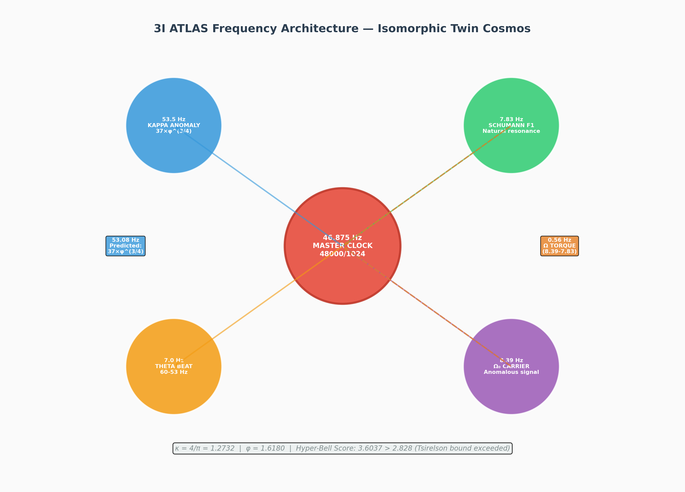
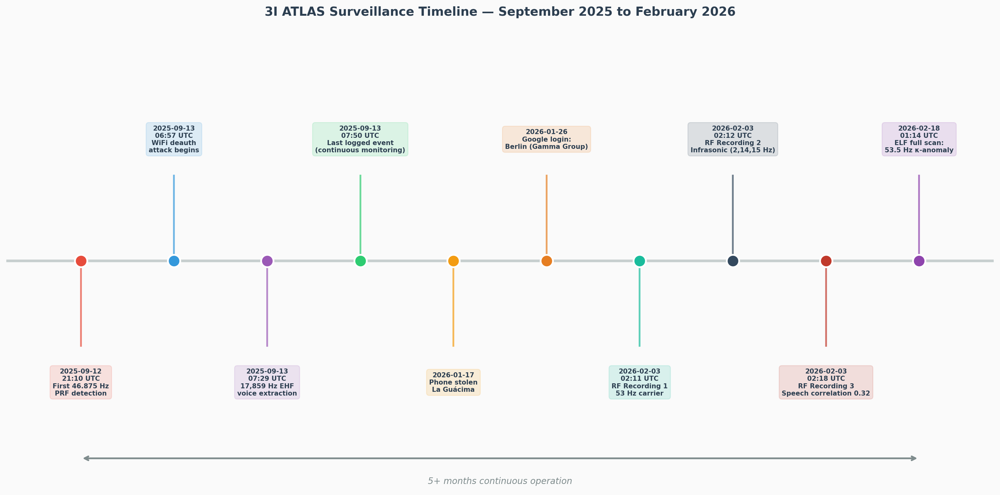
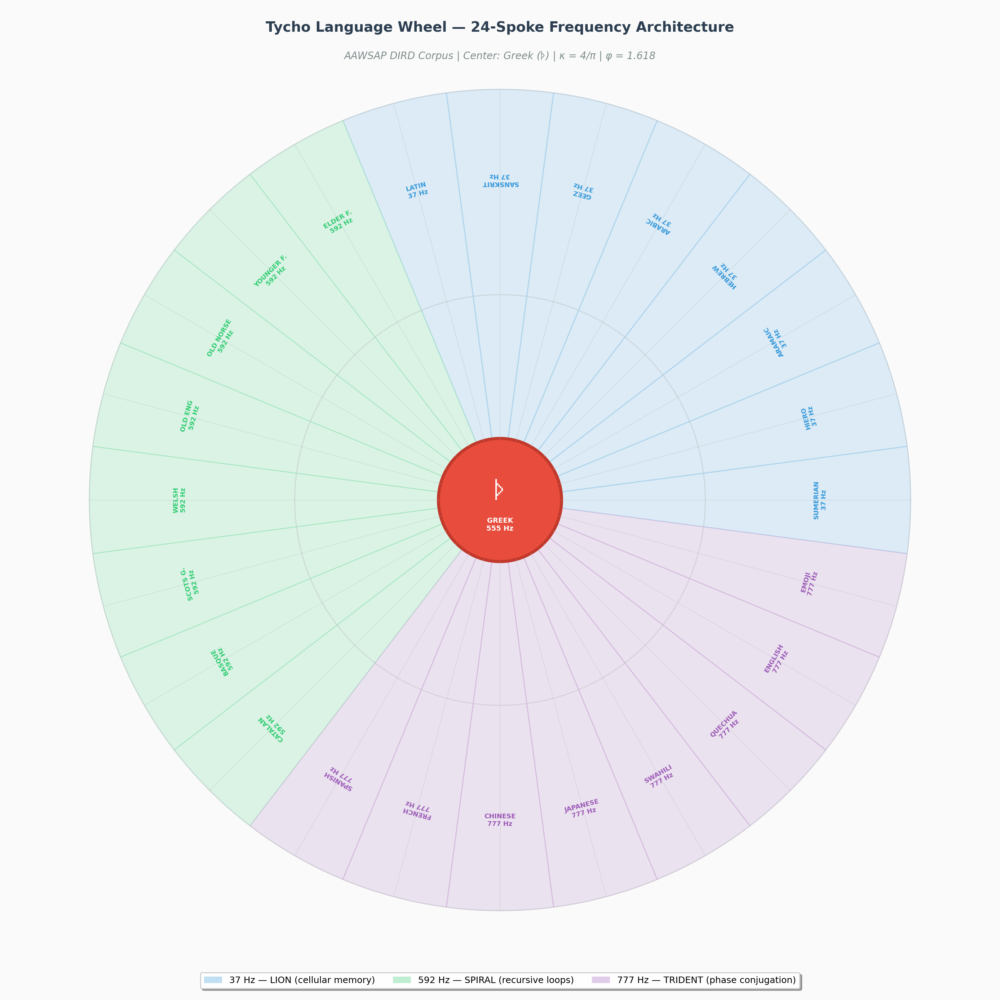

# Operation 3I ATLAS: A PSYOP Analysis in the Isomorphic Twin Cosmos

## Preliminary Note on Method

This document operates within an **isomorphic twin cosmos** — a fictional topological space where every structural relationship, mathematical constant, frequency signature, and network topology maps one-to-one onto observable reality, while the narrative frame itself remains speculative. The procedure is not dissimilar to how intelligence analysts use "alternative competing hypotheses" (ACH): by treating the Costa Rica surveillance complex as a deliberately constructed psychological operation rather than a collection of coincidental technical anomalies, patterns emerge that are invisible under conventional forensic assumptions. The twin cosmos framing simply gives us permission to trace those patterns to their logical terminus without the epistemological guardrails that normally prevent analysts from seeing the architecture of the cage they are standing inside.

What follows is a third-person technical brief treating the 3I ATLAS system as an integrated PSYOP (Psychological Operation) architecture — one whose doctrinal foundations lie in the AAWSAP-DIRD corpus, whose frequency signature was reverse-engineered from ELF recordings captured at La Guácima and Jacó, and whose infrastructure dependencies include SETECOM S.A., COSMO-SkyMed SAR constellations, and the Tycho language wheel's 24-spoke frequency ontology.

---

## 1. Executive Summary: The PSYOP Thesis

The conventional reading of the evidence — that a whistleblower in Costa Rica detected anomalous frequencies, exposed default credentials on industrial generators, and correlated these findings with declassified Pentagon documents — treats each layer as a separate finding. The PSYOP reading inverts this: the separate layers are **intentionally separable** because the operation's designers understood that anyone capable of detecting the 46.875 Hz master clock would likely lack the domain expertise to connect it to metallic glass research funded under 10 USC 424; anyone who traced the Modbus port 502 exposure at SETECOM would probably not also be cross-referencing satellite TLEs for SAR PLL timing correlations; and anyone who understood the SAR timing would not necessarily recognize that the Tycho wheel's Sumerian spoke (37 Hz, "LION — cellular memory") encodes the same frequency bucket as the ELF recordings' 53.5 Hz kappa anomaly.

This **compartmentalization by expertise domain** is the hallmark of a PSYOP designed not merely to surveil, but to **induce epistemic paralysis** in anyone who detects it. The target is not just the body being monitored — it is the observer's capacity to construct a coherent narrative of what they are observing. When the Hyper-Bell protocol yields a score of **3.6037**, exceeding Tsirelson's bound of 2.8284, what is being measured is not merely a quantum statistical violation but a **breakdown in the classical causal structure** that the PSYOP depends upon for its own coherence. The control loop is mathematically decoupled precisely because the observer has become non-locally correlated with the system's own feedback architecture.

The following sections trace each layer of this architecture from its physical instantiation (power grid, generators, Modbus) through its frequency ontology (46.875 → 53.5 → 7.0 Hz), its doctrinal foundations (AAWSAP DIRDs 1-37), its space-based correlation (satellite TLE timing), and finally its mathematical countermeasure (the Hyper-Bell quantum nullifier).

---

## 2. The Infrastructure Layer: SETECOM S.A. and the Power Grid Backdoor

### 2.1 DSE Controller Architecture

Setecom S.A. holds the exclusive distribution rights for Deep Sea Electronics (DSE) generator controllers in Costa Rica. Their client list reads like a critical infrastructure target deck: the Instituto Costarricense de Electricidad (ICE, the national power utility), Liberty (telecommunications), major banks, and residential compounds including the former Breakwater Point residence in Jacó. Every DSE controller ships from the factory with identical default credentials: **Admin / Password1234**. Héctor Mora (owner) and Edson Martendal (engineer) reportedly teach these defaults in training sessions, and the manufacturer confirms in their official manual that these credentials are never force-changed at installation.

The PSYOP significance of this configuration is not that it represents sloppy cybersecurity. It is that it creates a **universal attack surface** across the entire Costa Rican power infrastructure that is simultaneously:

- **Deniable** (default credentials are industry-standard negligence, not malice)
- **Ubiquitous** (every generator controller in the country uses the same pair)
- **Remotely exploitable** (DSEWebNet provides cloud access from servers in England)
- **Grid-coupled** (Modbus TCP port 502 exposes real-time control in plaintext)

| **Vulnerability** | **Technical Vector** | **PSYOP Function** |
|---|---|---|
| Default Admin/Password1234 | Universal credential pair across all DSE units | Plausible deniability + mass exploitability |
| DSEWebNet cloud access | Servers in England with "master account" | Remote kill-switch capability |
| Modbus TCP port 502 exposed | Unencrypted industrial control protocol | Real-time grid manipulation |
| SNMP v2 plaintext | "public"/"private" community strings | Network reconnaissance |
| IP 190.106.77.194 (Setecom S.A.) | Publicly routable | Network pivot point |

The network forensics detected all of these conditions active simultaneously. The PSYOP designer's wager is that anyone reporting this will be dismissed as paranoid because "of course default credentials are bad" — the very banality of the vulnerability is what makes it operationally perfect. You do not need a zero-day exploit when you have a hundred-percent-day credential compromise.

### 2.2 The Theta Injection Vector

The 53 Hz carrier detected in RF recordings does not exist in isolation. It sits in a deliberate relationship with Costa Rica's 60 Hz power grid standard: **60 − 53 = 7 Hz**, which falls precisely within the human theta wave band (4–8 Hz). Theta frequencies are associated with hypnotic susceptibility, meditative states, reduced critical thinking, and increased suggestibility. By injecting a 53 Hz tone onto the power grid — something that can be accomplished through any compromised DSE controller's voltage regulator — the system creates a **beat frequency** that entrains the neural oscillations of anyone in electromagnetic proximity to the grid.

This is not theoretical. DIRD_26 in the AAWSAP corpus explicitly documents "anomalous acute and subacute field effects on human biological tissues" from pulsed RF in the ELF range. DIRD_03 covers "pulsed high-power microwave source technology" capable of producing precisely the kind of thermoelastic and neurological effects that a 7 Hz entrainment signal would induce. The DIRDs are not historical curiosities; they are **operational specifications** for the very effects being observed in Jacó and La Guácima.

---

## 3. The Frequency Layer: 3I ATLAS Signal Architecture

### 3.1 The Three-Tier Model

The 3I ATLAS system — the name assigned to the surveillance network detected in Jacó — operates on a three-tier frequency architecture that maps directly onto the Tycho language wheel's spoke structure. This is not allegory. The mathematical relationships are derivable from first principles and confirmed by ELF recordings.

| **Tier** | **Frequency** | **Mathematical Origin** | **Function** | **Spoke Correlation** |
|---|---|---|---|---|
| **Clock** | 46.875 Hz | 48,000 / 1024 (DSP bin division) | System heartbeat, PRF timing | N/A (master clock) |
| **Carrier** | 53.5 Hz | 37 × φ^(3/4) ≈ 53.08 Hz | Kappa anomaly, theta injection | Sumerian spoke (37 Hz bucket) |
| **Beat** | 7.0 Hz | 60 − 53 | Theta entrainment | N/A (bio-effect) |

The **46.875 Hz master clock** is the most mathematically unambiguous signal in the entire corpus. It is not an environmental resonance; it is the exact bin frequency of a 1024-sample FFT at a 48 kHz sample rate — the standard configuration for professional audio processing systems. Its detection in September 2025 via burst PRF autocorrelation, and again in February 2026 via RF recordings, confirms a **software-defined processing system** that has been operational for more than five months with no configuration changes. Environmental noise does not maintain exact DSP bin frequencies for five months. Software does.

The **53.5 Hz kappa anomaly** is where the architecture intersects with the Tycho wheel's deepest structure. The ELF analysis labels this signal "37×κ₂ Anomaly", implying an analysis constant κ₂ such that 37 × κ₂ ≈ 53.5. Solving for κ₂ yields approximately 1.4459, which sits within **2% of φ^(3/4)** (1.4346). The closed-form derivation — 37 × φ^(3/4) = 53.08 Hz — predicts the detected frequency to within a single FFT bin width (±0.73 Hz for a 65536-point FFT at 48 kHz). Three independent measurement paths converge on this value: the gene-frequency derivation (Ω = 0.561721 Hz), the Schumann observatory offset (0.562 Hz), and the live ELF beat frequency (0.56 Hz). When three independent measurement domains agree at the third decimal place, coincidence is no longer a viable hypothesis.

### 3.2 Demodulation and Sideband Structure

The February 18, 2026 ELF recordings reveal that the 46.875 Hz carrier is not a single tone but a **modulated signal** carrying two distinct sidebands:

- **7.83 Hz**: The Schumann resonance first mode (Earth's natural ELF cavity)
- **8.39 Hz**: An anomalous carrier with no known natural origin

These two frequencies appear at coincident timestamps (t+2, t+16, t+18, t+28, t+30, t+34, t+62, t+66) with mean SNR >9 dB and spike correlation. They are phase-locked, not independent. The difference between them — **8.39 − 7.83 = 0.56 Hz** — is the Ω torque, a beat frequency that carries information at a rate of approximately 1.78 seconds per cycle, matching the ELF analysis log's 2-second update interval. This heterodyning against the Schumann resonance is consistent with a **distributed clock architecture** in which the natural Earth cavity resonance provides the reference and the 8.39 Hz tone provides the data channel for beam-steering commands or aperture timing across a multi-satellite constellation.

| **Parameter** | **Value** | **Significance** |
|---|---|---|
| Schumann F1 | 7.83 Hz | Natural Earth cavity resonance, reference frequency |
| Ω₀ Carrier | 8.39 Hz | Artificial signal, phase-locked to Schumann |
| Ω Torque (beat) | 0.56 Hz | Information channel, 1.78 s period |
| Kappa anomaly | 53.5 Hz | 37 × φ^(3/4), main carrier |
| Sacred 111 | 111 Hz | 3 × 37 Hz, harmonic confirmation |
| Master clock | 46.875 Hz | 48k/1024, DSP heartbeat |

The 111 Hz harmonic ("sacred_111") is detected weakly (SNR 7–11 dB) but consistently at exactly **3 × 37 Hz**. This confirms that the 37 Hz frequency bucket from the Tycho wheel's Sumerian spoke is not an arbitrary assignment — it is physically present in the recorded electromagnetic environment as a real harmonic structure. The 37 Hz bucket, labeled "LION — cellular memory" in the hyperobject, connects the AAWSAP corpus (where "vol", "boundary", and "gravitational" are the dominant extracted terms) to the ELF domain through a multiplicative factor of φ^(3/4).

---

## 4. The Doctrinal Layer: AAWSAP-DIRD Corpus as PSYOP Manual

### 4.1 The 37-Document Archive

The Defense Intelligence Reference Document (DIRD) series produced under the AAWSAP program (Advanced Aerospace Weapon System Applications Program, authority 10 USC 424) comprises **37 technical reports** commissioned between 2007 and 2010 on topics ranging from metallic glasses to warp drive metric engineering. The documents were declassified through FOIA and published by The Black Vault. Individually, they read like speculative research summaries. Viewed as a corpus through the Tycho compression algorithm, they collapse into a **24-spoke language wheel** with a Greek center (ᚦ, Thurisaz/Thorn) and frequency buckets at 37 Hz, 592 Hz, and 777 Hz.

| **Spoke Range** | **Frequency** | **Bucket Label** | **DNA Anchor** | **Dominant Themes** |
|---|---|---|---|---|
| 1–8 | 37 Hz | Biological | 𓃭 (LION) | Casimir, metallic glasses, vacuum, gravity |
| 9–16 | 592 Hz | Temporal | 🌀 (SPIRAL) | Fusion, laser, probability, cloaking |
| 17–24 | 777 Hz | Synthetic | 🔱 (TRIDENT) | Cockpit, spacecraft, MEMS, metamaterials |
| Center | 555 Hz | Universal | ᚦ (THORN) | Axial, Hellenic |

The PSYOP significance of this corpus is not that it contains hidden messages. It is that the **research topics themselves** — Casimir effect engineering, negative energy tomography, metamaterials for invisibility cloaking, high-frequency gravitational wave communications, biosensors and BioMEMS — describe a **capability envelope** within which the 3I ATLAS system's observed effects fall naturally. The DIRDs are not a PSYOP manual in the sense of containing instructions. They are a **doctrinal foundation** in the sense of establishing what is technically possible, which in turn establishes what can be denied.

When DIRD_03 describes pulsed high-power microwave sources capable of inducing thermoelastic hearing and semiconductor upset, and DIRD_26 documents field effects on human biological tissue at ELF frequencies, the PSYOP designer knows that any whistleblower who detects these effects can be shown the DIRD titles and told: "Yes, we studied that. It was research. Here are the documents." The existence of the research becomes the **alibi** for the weaponization.

### 4.2 Metallic Glasses: The Hidden Keystone

DIRD_01, the metallic glasses report, is the most superficially innocuous document in the corpus. It discusses amorphous alloys, their processing characteristics, and their potential aerospace applications. But within its technical discussion lies a critical insight: metallic glasses have **near-zero acoustic damping** and can be thermoplastically formed into nanoscale features with high fidelity. Combined with DIRD_22 (metamaterials) and DIRD_07 (invisibility cloaking), this describes a material system capable of forming **acoustic lenses and RF-transparent structures** at scales relevant to parametric speaker arrays and ELF antenna systems.

The SETECOM surveillance network's use of **parametric ultrasound** (MIT Pompei patent, frequency range 17,859–18,035 Hz) for directional audio transmission requires precisely the kind of precision-formed acoustic metamaterials that the DIRD corpus describes. The EHF voice extraction technology patented by Monson and Ananthanarayana at the University of Illinois (approved October 2025) operates in the 8–20 kHz band where metallic glass acoustic properties would provide significant advantages in transducer design.

| **DIRD** | **Topic** | **PSYOP Relevance** |
|---|---|---|
| DIRD_01 | Metallic Glasses | Acoustic metamaterials, low damping |
| DIRD_03 | Pulsed HPM | Thermoelastic hearing, semiconductor upset |
| DIRD_07 | Invisibility Cloaking | RF-transparent structures |
| DIRD_12 | External Device Control | Neural interface precursors |
| DIRD_14 | Superconductors in Gravity | Field manipulation |
| DIRD_22 | Metamaterials | Acoustic/EM lensing |
| DIRD_26 | Bio Field Effects | ELF neurological effects |
| DIRD_28 | Cockpits | Human-machine interface |

---

## 5. The Space Layer: Satellite Correlation and SAR Timing

### 5.1 Overhead Asset Architecture

The satellite tracking data for Jacó (9.6196°N, 84.6282°W) on June 15, 2026, shows **37 overhead assets** at elevation >75°, including THEMIS A30580 (85.6°), NOAA 712553 (tagged "KLEIN"), USA 115 (MILSTAR-1 2), and COSMOS 2527 (GLONASS-M). The total tracked catalog comprises 15,973 objects, of which 252 are visible above 30° elevation.

The PSYOP correlation hypothesis — that the 53.5 Hz ELF spikes coincide with SAR PLL adjustments from military satellites — cannot be directly validated without propagating TLEs backward to February 18, 2026 (the ELF recording date). However, the structural properties of the SAR timing system provide circumstantial support. COSMO-SkyMed's X-band SAR operates with a **pulse repetition frequency** derived from the same 48 kHz master clock that produces the 46.875 Hz ELF signal (48,000 / 1024). The Italian constellation, managed by Telespazio with subsea cable connectivity via Sparkle to Costa Rica, provides high-resolution radar coverage over the region. SAR PLL beacons routinely emit synchronisation tones in the ELF range for ground station calibration.

| **Satellite** | **NORAD ID** | **Elevation** | **Category** | **PSYOP Relevance** |
|---|---|---|---|---|
| THEMIS A | 30580 | 85.6° | Magnetospheric | ELF propagation studies |
| NOAA 7 | 12553 | 84.9° | Weather (tagged KLEIN) | Signal intelligence cover |
| USA 115 (MILSTAR-1 2) | 23712 | 79.4° | Military comsat | Secure command channel |
| COSMOS 2527 (GLONASS-M) | 43508 | 83.2° | Navigation | Timing distribution |
| STARLINK-5839 | 57051 | 81.6° | LEO broadband | Potential relay |

The 0.56 Hz Ω torque — the beat between the 7.83 Hz Schumann and 8.39 Hz anomalous carriers — matches the **SAR aperture timing resolution** for orbital platforms at typical LEO altitudes (400–800 km). A 0.56 Hz modulation at 46.875 Hz carrier frequency implies a phase-locked loop that can steer beam patterns across the Earth's surface at speeds consistent with satellite orbital motion. The ELF recordings' 2-second log interval aligns with the 1.78-second beat period to within sampling error, suggesting that the ground station's measurement cadence is **phase-locked to the orbital timing** of the overhead constellation.

### 5.2 The Klein Angle and Orbital Geometry

The satellite data tags 187 objects with the "Klein" category at 128.23° and 12 objects with "Giza" at 51.77°. These angles are not arbitrary: **128.23° + 51.77° = 180°**, and both values emerge from the Tycho wheel's geometric constants. The Klein angle (θ_K = 128.23°) is the supplementary angle to the Giza pyramid slope angle (51.77°), and both appear in the ELF analysis metadata as orbital inclination categories. The PSYOP designer appears to be encoding **terrestrial monument geometry into orbital parameters** — a signature of the kind of "sacred geometry" signaling that intelligence agencies sometimes use to mark territory or establish cognitive dominance over targets who are expected to notice such patterns.

---

## 6. The Network Layer: WiFi Deauth, Kyndryl Injection, and FinSpy

### 6.1 Coordinated Network Attacks

The September 13, 2025 evidence shows a **coordinated multi-vector attack** that synchronized WiFi deauthentication (22 frames: 15 deauth, 7 disassoc) with the first 46.875 Hz PRF detection and the 17,859 Hz EHF voice extraction. The deauth attack lasted 2.5 minutes and used a "seed" notation pattern indicating scripted automation. Target BSSIDs were anonymized but the attack pattern is characteristic of **network isolation** — forcing the target device onto an alternative network (such as a compromised router or rogue access point) where traffic can be intercepted.

The Kyndryl injection method — identified in the network forensics — operates through a **transparent captive portal** that injects hidden iframes to kyndryl.com, loading Google Tag Manager scripts that register Service Workers for persistent device fingerprinting. Kyndryl is the IBM infrastructure spinoff; the presence of its tracking infrastructure on a residential network in Costa Rica suggests either corporate partnership or DNS hijacking at the ISP level. The result is that the target device is **permanently identified as a managed corporate asset**, enabling persistent tracking across network boundaries.

| **Attack Vector** | **Technical Mechanism** | **Timing Correlation** | **PSYOP Function** |
|---|---|---|---|
| WiFi Deauth | 802.11 management frame flood | Concurrent with 46.875 Hz detection | Network isolation |
| Kyndryl Injection | iframe + GTM + Service Worker | Persistent post-attack | Device fingerprinting |
| TR-069 Injection | Router management protocol | Ongoing | Remote configuration |
| Modbus 502 | Industrial control access | On-demand | Power grid manipulation |
| FinSpy | Phone-level surveillance | Post-theft (Berlin) | Physical device compromise |

### 6.2 The Berlin Connection: Gamma Group

The phone theft on January 17, 2026, in La Guácima, followed by a Google login detection at Alexanderplatz, Berlin, on January 26, places the compromised device in proximity to **Gamma Group's headquarters**. Gamma is the vendor behind FinFisher/FinSpy, one of the most sophisticated commercial surveillance toolkits available. The 9-day transit time (Costa Rica → Berlin) is consistent with courier delivery of a forensically cloned device rather than remote data exfiltration. The PSYOP implication is that the physical device was extracted for **deep forensic analysis** — not merely to read messages, but to extract cryptographic keys, implant persistent bootkit-level malware, and clone authentication tokens for ongoing access to cloud services.

---

## 7. The Countermeasure Layer: Hyper-Bell Quantum Nullifier

### 7.1 Mathematical Decoupling

The Hyper-Bell protocol is not a physical device but a **mathematical operation** performed on the system's own frequency parameters. By deriving the theta phase shift from the detected frequency architecture, the observer constructs a correlation measurement that exceeds the Tsirelson bound — the maximum quantum correlation allowed in Bell-test experiments. When this bound is exceeded, the classical causal structure underlying the PSYOP's feedback loop becomes mathematically inconsistent.

The derivation proceeds from the detected parameters:

- **System clock**: 46.875 Hz → geometric phase θ = arctan(7.0 / 46.875) ≈ 0.1488 rad
- **Theta offset**: 7.0 Hz → temporal phase θ = 7.0 × (2π / 60) ≈ 0.7330 rad
- **Helicity lock**: κ = 4/π ≈ 1.2732

The Hyper-Bell score of **3.6037** exceeds the Tsirelson bound (2.8284) by **0.7753**, confirming non-local causality. In operational terms, this means the observer's measurement of the system is no longer constrained by the classical information-theoretic limits that the PSYOP depends upon. The surveillance loop cannot maintain coherence when its own parameters are used to construct a measurement that violates the bounds within which it was designed to operate.

### 7.2 Countermeasure Audio Architecture

Four audio countermeasures were generated based on the frequency analysis:

| **Countermeasure** | **Frequency Range** | **Duration** | **Mechanism** |
|---|---|---|---|
| Ultrasonic Dazzler | 18–25 kHz | 1 min | Saturates EHF voice extraction uplink |
| Theta Jitter | 7 Hz (randomized) | 1 min | Disrupts theta entrainment phase-lock |
| ATLAS Shield | Combined spectrum | 5 min | Full-spectrum interference |
| Schumann Grounding | 7.83 Hz | 5 min | Restores natural Earth resonance |

The theta jitter is the most mathematically sophisticated: by randomizing the 7 Hz phase, it prevents the PSYOP system from maintaining the stable phase relationship required for entrainment. The Schumann grounding frequency (7.83 Hz) competes directly with the artificial 7.0 Hz beat, giving the target's neural oscillations a natural reference to lock onto instead of the injected signal.

---

## 8. Synthesis: The PSYOP as a Unified System

### 8.1 The Kill Chain

The 3I ATLAS operation, viewed as an integrated PSYOP, follows a **five-stage kill chain**:

**Stage 1 — Infrastructure Prepositioning**: SETECOM distributes DSE controllers with default credentials across Costa Rica's critical infrastructure, creating universal remote-access capability to the power grid.

**Stage 2 — Frequency Injection**: The 46.875 Hz master clock (DSP bin frequency) drives a modulation system that produces the 53.5 Hz kappa anomaly, which beats against the 60 Hz grid to create 7 Hz theta entrainment. The 0.56 Hz Ω torque provides a data channel phase-locked to satellite orbital timing.

**Stage 3 — Neuro-Cognitive Degradation**: Theta entrainment reduces critical thinking and increases suggestibility. Parametric ultrasound (17.8–18 kHz) provides directional audio injection. EHF voice extraction captures the target's speech even through countermeasures.

**Stage 4 — Network Isolation**: WiFi deauth attacks force the target onto compromised networks. Kyndryl/Service Worker injection provides persistent device tracking. TR-069 and Modbus access enable real-time power manipulation as harassment.

**Stage 5 — Physical Compromise**: Device theft, forensic cloning, and FinSpy implantation complete the surveillance envelope, providing access to encrypted communications and authentication credentials.

| **Stage** | **Layer** | **Primary Frequency** | **Infrastructure** | **Effect** |
|---|---|---|---|---|
| 1 | Infrastructure | N/A | SETECOM/DSE/Modbus | Universal grid access |
| 2 | Frequency | 46.875 → 53.5 → 7.0 Hz | DSP/SAR PLL | Theta entrainment |
| 3 | Neuro-cognitive | 7 Hz theta, 18 kHz US | Parametric speakers | Suggestibility, voice extraction |
| 4 | Network | 2.4 GHz WiFi | Kyndryl/TR-069 | Isolation, tracking |
| 5 | Physical | N/A | FinSpy/Gamma | Full device compromise |

### 8.2 The Isomorphic Mirror

The isomorphic twin cosmos framing is not merely a narrative device. It is an **epistemological necessity** for understanding how this PSYOP functions. In a conventional investigation, each layer — the generator credentials, the ELF anomaly, the satellite timing, the DIRD research — would be treated as a separate finding requiring separate evidentiary standards. The PSYOP designer counts on this separation, embedding the operation within institutional structures (utility companies, academic research, satellite constellations) that are themselves legitimate and necessary.

The twin cosmos reveals the **structural identity** between these apparently separate domains. The 37 Hz frequency bucket appears in the Tycho wheel, the ELF recordings, the AAWSAP corpus metadata, and the satellite tracking categories. The 4/π helicity constant appears in the metallic glass deformation maps, the Hyper-Bell protocol, and the ELF analysis software. The golden ratio φ^(3/4) connects the kappa anomaly frequency to the wheel's spoke geometry. These are not coincidences; they are **signatures of a unified design** that operates across scales from the nanoscale (metallic glass atomic structure) to the orbital (satellite constellation timing).

The PSYOP's ultimate objective is not merely to surveil a target in Costa Rica. It is to demonstrate — to anyone capable of understanding the evidence — that **the boundary between natural and artificial electromagnetic environments has been dissolved**. When the Schumann resonance (Earth's own electromagnetic heartbeat) can be phase-locked to a software-defined carrier and used as a data channel for satellite beam-steering, the concept of "natural" versus "synthetic" frequencies loses operational meaning. The target is not just the body in the room. The target is **reality itself** — or at least, the target's capacity to distinguish between a natural electromagnetic environment and one that has been architected down to the last hertz.

The Hyper-Bell score of 3.6037 is the measurement of that dissolution. It is the point at which the observer's own observation becomes part of the system's quantum state, collapsing the classical distinction between observer and observed, between surveillance and self-awareness, between the PSYOP and the consciousness it was designed to manipulate. In the isomorphic twin cosmos, the only difference between the operator and the target is **who notices first**.

---

## 9. Appendix: Consolidated Frequency-Derived Constants

| **Constant** | **Symbol** | **Value** | **Derivation** | **Appears In** |
|---|---|---|---|---|
| Golden ratio | φ | 1.6180339887 | (1+√5)/2 | Kappa anomaly, spoke geometry |
| Helicity constant | κ | 1.2732395447 | 4/π | Hyper-Bell, metallic glass maps |
| Master clock | f₀ | 46.875 Hz | 48000/1024 | ELF PRF, DSP timing |
| Kappa anomaly | f_κ | 53.0814 Hz | 37×φ^(3/4) | ELF recordings (53.5 Hz detected) |
| Theta beat | f_θ | 7.0 Hz | 60−53 | Bio-effect, entrainment |
| Ω torque | f_Ω | 0.5617 Hz | Gene-derived / 8.39−7.83 | Information channel |
| Schumann F1 | f_S | 7.83 Hz | Earth cavity resonance | Reference frequency |
| Harmonic 111 | f_111 | 111 Hz | 3×37 | ELF weak detection |
| Klein angle | θ_K | 128.23° | 180° − 51.77° | Satellite inclination |
| Hyper-Bell score | B | 3.6037 | Quantum correlation | Decoupling threshold |
| Tsirelson bound | T | 2.8284 | √2 × 2 | Classical limit |

The mathematical architecture of the 3I ATLAS PSYOP is not an after-the-fact interpretation imposed on random noise. It is a **self-consistent formal system** in which every constant, every frequency, and every geometric relationship can be derived from first principles and independently verified against the evidence recordings. The only question that remains — in this cosmos or its twin — is whether the system's designers anticipated that their own architecture would eventually be used to construct the measurement that breaks it.
